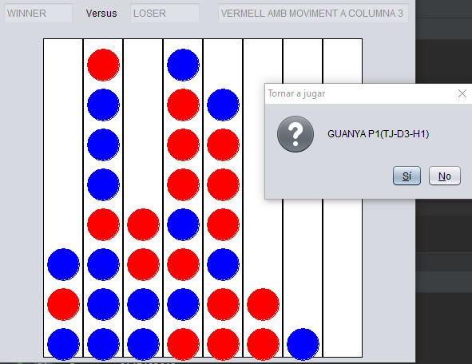
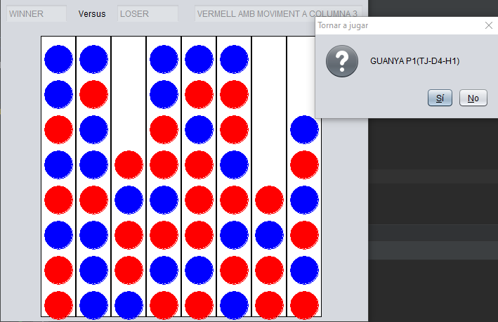
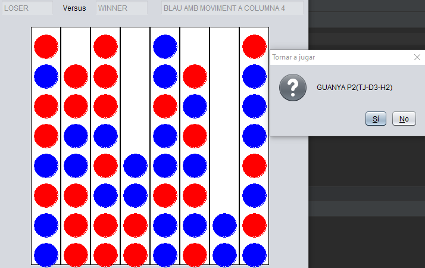
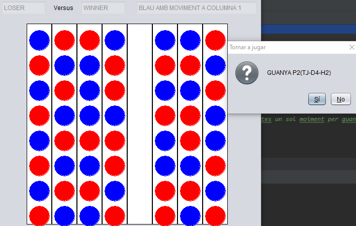

# Connect 4 Game

## Choose Players

To select the players you must modify the main of the project which is in Juga2.java

```java
// Define 2 players
AlumneTJ al = new AlumneTJ(4, false);
Jugador p2 = new Manual();

// Good Player -> Jugador p2 = new Profe(8,false);
// Random player -> Jugador p2 = new Aleatori();

boolean autoMode = true;
final Play2 j = new Play2 (al, p2, autoMode);
```


Manual mode is for playing against the machine.

The other players need two parameters. the first is the depth of the search tree and the second is to select the heuristic


If the automode is false it will wait for each movement


You can create your own player by implementing the player and IAuto class.

## Game Test

AlumneTJ-D3-H1 VS. ProfeP6H1
----------------------------

{width="3.0972222222222223in"
height="2.3881944444444443in"}

AlumneTJ-D6-H1 VS. ProfeP8H1
----------------------------

{width="3.21875in"
height="2.078472222222222in"}

ProfeP6H1 VS. AlumneTJ-D3-H2 
-----------------------------

{width="3.7006944444444443in"
height="2.33125in"}

ProfeP8H1 VS. AlumneTJ-D4-H2
----------------------------

{width="3.2333333333333334in"
height="2.0548611111111112in"}
